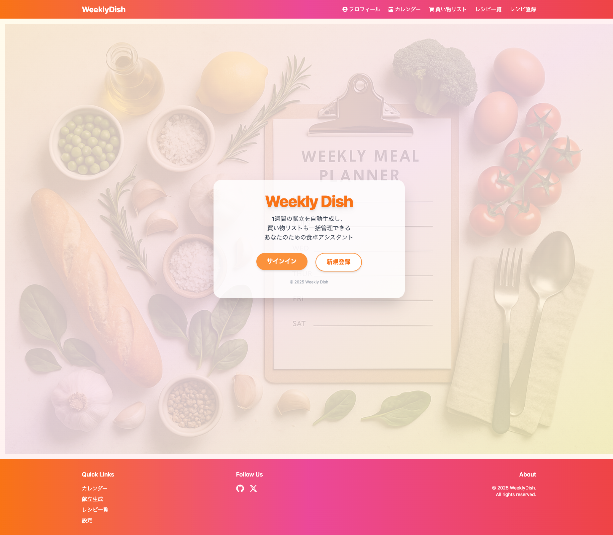
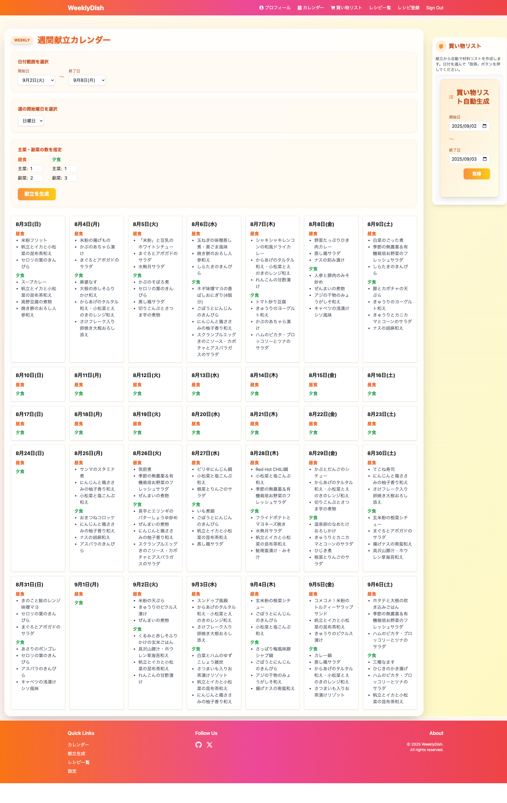

# 🍳 Weekly Dish

[🌐 デモサイトはこちら](https://weekly-dish-git-main-tonchans-projects.vercel.app/)

**Weekly Dish**は、忙しい毎日でも「美味しい・バランスの良い食卓」を叶える  
現代的なUI/UXの **献立自動生成＆買い物リスト管理Webアプリ** です。

---

## 👤 Author
- [TonChan0828](https://github.com/TonChan0828)  
  組込みソフト開発の実務経験を経て、Webアプリケーション開発に挑戦中です。

---

## 🥗 アプリ紹介

- **1週間分の献立をワンクリック自動生成**  
  主菜・副菜のバランスを考慮し、毎日のメニューを提案
- **カレンダーUIで直感的に献立を管理・編集**
- **必要な材料を自動で買い物リスト化**  
  スーパーでの買い忘れゼロへ
- **レシピ詳細・材料・手順も一元管理**
- **プロフィール編集・ユーザー削除も簡単**
- **美しいブランドカラー・統一感あるデザイン**
- **スマホ・PCどちらでも快適なレスポンシブ対応**

---

## ✨ 主な機能
- サインアップ/サインイン（メール認証対応）
- 1週間分の献立自動生成（主菜・副菜のバランス考慮）
- カレンダーUIで献立を可視化・編集
- 買い物リスト自動生成
- レシピ詳細表示・材料・手順管理
- プロフィール編集・ユーザー削除
- レスポンシブ対応・モダンなデザイン

---

## 📸 スクリーンショット
  


---

## 🛠 技術スタック
- **Next.js 15（App Router）** – 最新のReactフレームワーク
- **React 19** – コンポーネントベースUI
- **Supabase** – 認証（Auth）、Postgresデータベース、Edge Functions
- **Tailwind CSS** – スタイリング
- **shadcn/ui** – UIコンポーネント
- **date-fns** – 日付処理ライブラリ

---

## 🚀 セットアップ手順

1. リポジトリをクローン
   ```sh
   git clone https://github.com/TonChan0828/WeeklyDish.git
   cd WeeklyDish/weekly-dish
2. 依存パッケージをインストール
sh
   npm install
3. Supabaseプロジェクトを作成し、.env.localに環境変数を設定
env
   NEXT_PUBLIC_SUPABASE_URL=...
   NEXT_PUBLIC_SUPABASE_ANON_KEY=...
   SUPABASE_SERVICE_ROLE_KEY=...
4. 開発サーバー起動
sh
   npm run dev
5. [http://localhost:3000](http://localhost:3000) にアクセス
 ---
## デプロイ - Vercel推奨（Supabase連携も簡単） 
- 環境変数（.env）をVercelのプロジェクト設定に追加
- npm run build でビルド

---

### 開発・運用Tips 
- SupabaseのRLS（Row Level Security）有効時は、DBポリシー・外部キー制約（ON DELETE CASCADE）を適切に設定してください
- 認証系ページのsearchParamsはPromiseとしてawaitしてから使う必要があります（Next.js 15+）
- UIカスタマイズはTailwind CSS・shadcn/uiで柔軟に対応可能

 ---
